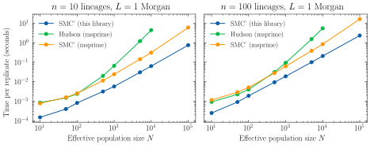

# smc_prime

This library implements a SMC' simulator with a very close interface to the equivalent from `msprime`. I started working on this before the [1.4.0 release](https://tskit.dev/msprime/docs/stable/CHANGELOG.html) that added a new SMC(k) model. I do recommend using that model instead of this implementation. 

Still, it seems like my Rust implementation still has some performance gains on my machine, although I'm unsure why (using different data structures such as B-trees, compiler optimisations, smaller overhead in contrast with the general algorithm, etc.). It is also probably easier to extend. 

## Caveats

- By default, I assume non-discrete genomes and haploid population sizes (in contrast with `msprime`). 
- This project is under active development and might contain bugs!
